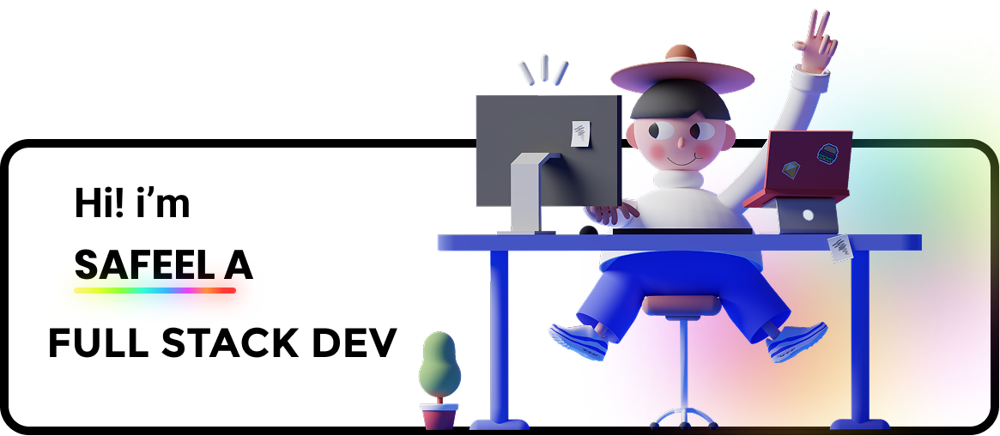

<div align="center">

<!-- Banner: replace with your actual banner image -->


</div>

<br>

<div align="center">

# Safeel A

**Full Stack Developer · AI Applications · Kerala, India**


Building AI-powered applications and modern web experiences that solve real-world problems.

[](https://safeel.in)
[](https://linkedin.com/in/itssafeel)
[](mailto:safeelsaffy@gmail.com)


</div>

---

## About Me

```javascript
const safeel = {
  name:     "Safeel A",
  username: "Charminglance",
  role:     "Full Stack Developer",
  focus:    ["Artificial Intelligence", "Full Stack Development", "Modern Web"],
  building: ["MedScan", "CropScan", "Inspiria'25"],
};
```

I enjoy working on applications where AI does something genuinely useful — especially local inference, privacy-preserving tools, and fast web experiences.

---

## Tech Stack

**Frontend**
`HTML` `CSS` `JavaScript` `React` `Next.js` `Tailwind CSS`

**Backend & AI**
`Node.js` `Express` `Python` `Flask` `Firebase` `MongoDB` `MySQL`

**AI / ML**
`MedGemma 4B` `Google Gemma 4` `MobileNetV2` `Ollama` `Hugging Face`

**Tools**
`Git` `GitHub` `VS Code`

---

## Featured Projects

### 🩻 MedScan — Privacy-first AI radiology assistant

Fully local X-ray analysis powered by **MedGemma 4B**. Generates structured radiology reports with findings, severity assessment, and clinical recommendations. Medical images never leave the user's machine.

`Python` `Flask` `Node.js` `Express` `MedGemma 4B` `Hugging Face`

---

### 🌿 CropScan — AI plant disease diagnosis

Combines **MobileNetV2** with **Google Gemma 4** to identify crop diseases, explain symptoms in natural language, and recommend treatments and preventive care. Fast local inference — no cloud required.

`Python` `Flask` `Node.js` `Express` `MobileNetV2` `Google Gemma 4` `Ollama`

---

### 🎉 Inspiria'25 — Official event website

Modern, responsive site built for **Inspiria'25** with smooth animations and a performance-first experience across desktop and mobile.

`HTML` `CSS` `JavaScript`

<br>

<div align="center">

**↳ More projects on my [GitHub profile](https://github.com/Charminglance)**

</div>

---

## GitHub Stats

<div align="center">


<br><br>


</div>

---

## Connect

| | |
|---|---|
| 🌐 **Portfolio** | [safeel.in](https://safeel.in) |
| 💼 **LinkedIn** | [linkedin.com/in/itssafeel](https://linkedin.com/in/itssafeel) |
| 📧 **Email** | [safeelsaffy@gmail.com](mailto:safeelsaffy@gmail.com) |

---

<div align="center">

Building products that are useful, intuitive, and powered by AI.

</div>
